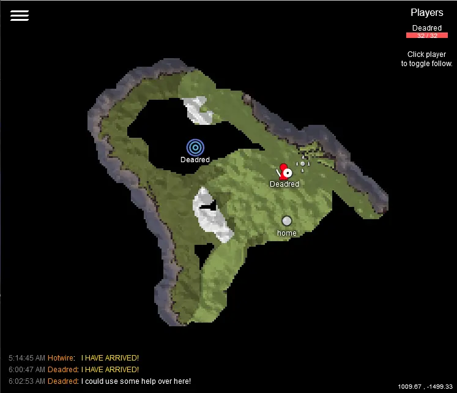

# Valheim WebMap

This server side mod creates a web based map that shows live players and allows shared exploration. After port forwarding the correct port, you can share `http://your_ip:port` to anyone else and they can see the map too. **Clients do not need to have any mods installed!**

For players to show up on the map, they must set **visible to other players** in the in-game map screen. Press `m` to bring up the map settings.

This has only been tested on a Valheim dedicated server. I'm not sure this will work with the built in server inclued with the base game.

## Features

* A explorable map of your Valheim world in your browser that you can zoom with the mousewheel or pinch zoom on mobile.
* Players can place their own pins with chat commands (see below for more info)
* Map pings from in game players will show up on the web map as well.
* Connected players list.
* Auto follow player feature.
* Chat messages.

## Installation

Assuming you have [BepInEx] installed and working, place the WebMap directory in:

    Steam\steamapps\common\Valheim dedicated server\BepInEx\plugins\WebMap

After starting the server for the first time a default configuration file will be created in:

    Steam\steamapps\common\Valheim dedicated server\BepInEx\config

## Updating

If you are updating, one additional thing you and anyone else using the web map might need to do is clear your browser cache.

You may also be able to hold down the `shift` key and click the reload button in your browser.

## Chat Commands

This mod supports placing pins with chat commands. Press `Enter` to start chatting in game. The commands are as follows:

* `!pin` - Place a "dot" pin with no text on the map where you are currently standing.
* `!pin my pin name` - Place a "dot" pin with "my pin name" under it on the map where you are currently standing.
* `!pin [pin-type] [text]` - Place a pin of a certain type with optional text under it on the map where you are currently standing.
    * Pin types are: `dot`, `fire`, `mine`, `house` and `cave`. Example command: `/pin house my awesome base`
* `!undoPin` - Delete your most recent pin.
* `!deletePin [text]` - Delete the most recent pin that matches the text exactly.

If a player creates too many pins, their oldest pin will be removed. There is a setting to control how many pins a player can create in `config.json`.

## Development

To get your environment working, you will need to find and place these .dll files in the WebMap/libs directory. Most of the libraries are found in:

`Steam\steamapps\common\Valheim dedicated server\valheim_server_Data\Managed`

* assembly_valheim.dll
* UnityEngine.CoreModule.dll
* UnityEngine.dll
* UnityEngine.UI.dll

You also need some Unity developer libraries (google for them).

* UnityEngine.ImageConversionModule.dll
* UnityEngine.JSONSerializeModule.dll

To get the fontend part building, you'll need [node] installed. After, just do `npm install` to install webpack. Then you can run `npm run build` to build `main.js` which should be included with the other web resources in `WebMap/web`.

I wanted to get this working as soon as possible, so apollogies for messy code.

## Licence

Where applicable, assume stuff is under the MIT licence.

## Credit

* Currently maintained by [Jeff Clark](https://github.com/h0tw1r3)
* Original work by [Kyle Paulsen](https://github.com/kylepaulsen)
* Background by [webtreats], released under the [CC BY 2.0] license.

[BepInEx]: https://github.com/BepInEx/BepInEx
[node]: https://nodejs.org/en/download/
[webtreats]: https://www.flickr.com/photos/webtreatsetc/4081217254
[CC BY 2.0]: https://creativecommons.org/licenses/by/2.0/
